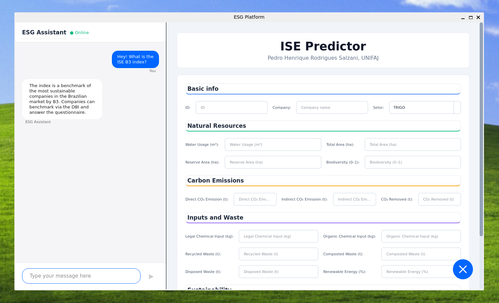

# Análise Preditiva do Índice de Sustentabilidade Empresarial com foco em dados ambientais.

  

Projeto desenvolvido na **Universidade de Jaguariúna (UNIFAJ)**. O objetivo deste trabalho é desenvolver uma plataforma de software capaz de prever o **Índice de Sustentabilidade** de empresas do setor agrícola com base em seus dados de performance **ambientais**.

## Contexto

A crescente demanda por práticas sustentáveis na indústria exige ferramentas mais inteligentes para avaliar e prever o impacto das operações das empresas. Este projeto utiliza técnicas de Machine Learning para analisar métricas ambientais como uso de água, emissões de CO₂, gestão de resíduos e biodiversidade.

## Funcionalidade

A interface apresenta dois módulos principais: um chatbot automatizado (ESG Assistant) baseado no modelo Gemma-2b-it, treinado para responder sobre o ISE B3, e o painel ISE Predictor, onde o usuário insere dados ambientais para a predição.

## Autores

* **[Pedro Henrique Rodrigues Salzani]** - *Desenvolvimento e Pesquisa* - [pedro.salzani789@al.unieduk.com.br]
* **[André Mendeleck]** - *Orientador*
